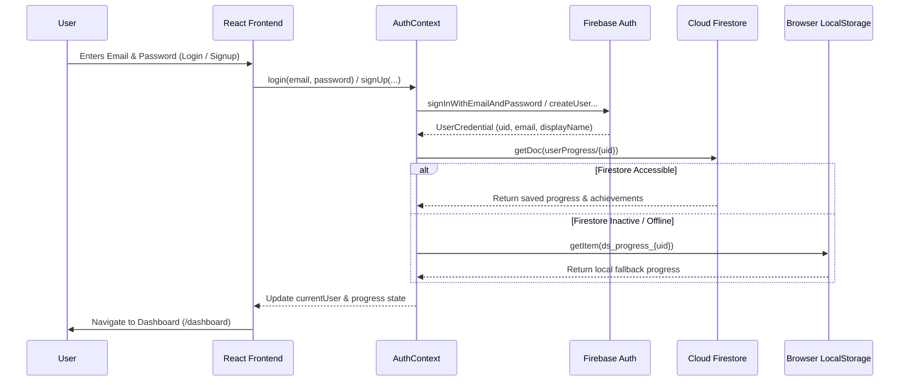

# DigitalShield — Community Digital Safety Awareness & Misinformation Prevention Platform

[](https://react.dev/)
[](https://vite.dev/)
[](https://workers.cloudflare.com/)
[](https://ai.google.dev/)
[](https://firebase.google.com/)
[](https://web.dev/progressive-web-apps/)

DigitalShield is an educational web platform and progressive web application (PWA) developed as part of a **Community Digital Safety Awareness and Misinformation Prevention Program** (Community Engagement Project / CEP). The platform is engineered to empower everyday citizens, students, and community members with the critical thinking skills, practical instincts, and automated analytical tools needed to detect misinformation, phishing attacks, online financial fraud, and deceptive web links.

---

## Table of Contents

1. [Project Overview & Purpose](#1-project-overview--purpose)
2. [Key Features](#2-key-features)
3. [The Check System](#3-the-check-system)
   - [News Check & Fact Verification](#news-check--fact-verification)
   - [Message / SMS / WhatsApp Check](#message--sms--whatsapp-check)
   - [Email Check](#email-check)
   - [Link & URL Safety Check](#link--url-safety-check)
   - [Multimodal Image Understanding](#multimodal-image-understanding)
4. [News Verification Architecture](#4-news-verification-architecture)
5. [Interactive Training System](#5-interactive-training-system)
   - [Scenario Practice Mode](#scenario-practice-mode)
   - [Digital Safety Challenge Mode](#digital-safety-challenge-mode)
   - [Achievements & Gamification](#achievements--gamification)
6. [Community Findings & Survey Data](#6-community-findings--survey-data)
7. [Authentication & User Progress](#7-authentication--user-progress)
8. [System Architecture](#8-system-architecture)
9. [Project Structure](#9-project-structure)
10. [Backend API & Cloudflare Worker](#10-backend-api--cloudflare-worker)
11. [Progressive Web App (PWA)](#11-progressive-web-app-pwa)
12. [Technology Stack](#12-technology-stack)
13. [Environment Configuration](#13-environment-configuration)
14. [Local Development Setup](#14-local-development-setup)
15. [Deployment Architecture](#15-deployment-architecture)
16. [Security & Privacy Practices](#16-security--privacy-practices)
17. [Academic / CEP Context](#17-academic--cep-context)
18. [Current Limitations](#18-current-limitations)
19. [Future Scope](#19-future-scope)
20. [Educational Disclaimer](#20-educational-disclaimer)

---

## 1. Project Overview & Purpose

### The Problem
The explosion of instant digital messaging, cheap smartphone access, and viral social media sharing has made everyday users vulnerable to an unprecedented wave of digital deception:
- **Misinformation & Fake News:** Fabricated news headlines, doctored screenshots, and false rumors spread rapidly across WhatsApp and social media, often causing panic, communal friction, or financial loss.
- **Deceptive Phishing:** Sophisticated emails and messages impersonate banks, tax authorities, courier services, and popular brands to steal login credentials and personal identities.
- **Financial & Online Scams:** Fraudulent lottery notifications, fake job offers, urgent electricity bill disconnection warnings, and deceptive QR/UPI payment requests dupe victims into transferring funds or revealing OTPs.
- **Malicious Links & Typosquatting:** Imposter websites mimic legitimate banking or government portals to capture passwords and card information.
- **Vulnerability of Non-Technical Users:** Everyday citizens, senior citizens, and first-time smartphone users frequently lack formal cybersecurity awareness and struggle to distinguish genuine communications from digital fraud.

### The Solution: DigitalShield
DigitalShield bridges this digital divide through an accessible, privacy-respecting educational ecosystem designed to **educate, evaluate, and empower**:
- **Multi-Vector Analysis:** Users can check text, messages, emails, links, or visual screenshots to uncover hidden manipulation techniques and deceptive indicators.
- **Real-Time Evidence Verification:** Claims are normalized, matched against authoritative public news agencies, and evaluated transparently.
- **Gamified Scenario Practice:** Users encounter real-world community scenarios in a safe environment, receiving immediate educational explanations.
- **Locally Grounded Community Insights:** The platform visualizes authentic field survey data (N = 40) directly reflecting local digital habits and vulnerabilities.

---

## 2. Key Features

| Feature | Route | Description |
|---|---|---|
| **Home** | `/` | Clean, interactive landing page introducing the core mission, 4-step user journey, checker launcher, and quick access cards. |
| **Check Hub** | `/check` | Central gateway directing users to specialized checkers with clear privacy notices. |
| **News Check** | `/check/news` | Analyzes claims, headlines, and screenshots using claim normalization, multi-source web retrieval, and evidence-only AI evaluation. |
| **Message Check** | `/check/message` | Evaluates SMS, WhatsApp, and chat texts or screenshots for high-pressure urgency, financial fraud, and impersonation. |
| **Email Check** | `/check/email` | Analyzes sender name, sender address, subject line, body text, or email screenshots for phishing red flags. |
| **Link Check** | `/check/link` | Performs automated server-side URL inspection (SSRF protection, redirect following, HTTPS checks, form detection) combined with AI safety scoring. |
| **Learn Hub** | `/learn` | Comprehensive library of 6 dedicated digital safety topics with detailed explanations, warning signs, and Do's & Don'ts. |
| **Learn Topic** | `/learn/:topicId` | Deep dive into individual topics (`fake-news`, `phishing`, `online-scams`, `suspicious-links`, `social-media`, `personal-info`). |
| **Training Hub** | `/training` | Gateway to hands-on scenario practice and the gamified Digital Safety Challenge. |
| **Scenario Practice** | `/practice`, `/practice/:categoryId` | Dynamic 5-question sessions generated via AI with Indian currency formatting (`₹`) and offline bank fallbacks. |
| **Safety Challenge** | `/quiz` | 10-question gamified quiz featuring answer streaks, score multipliers, personalized scorecard, and topic recommendations. |
| **Safety Tips** | `/safety-tips` | Essential rules and practical precautions for daily digital hygiene. |
| **Community Findings** | `/community-findings`, `/community` | Interactive charts and analytics visualizing authentic field survey data (N = 40) from `cep.xlsx`. |
| **Authentication** | `/login`, `/signup` | Firebase Authentication (Email/Password) allowing learners to maintain an ongoing record of their training milestones. |
| **Dashboard / Profile** | `/dashboard` | Protected user profile displaying scores, answer streaks, completed scenarios, and unlocked achievement badges. |
| **Theme Toggle** | Navbar | Seamless Dark and Light mode switching with system preference detection and local persistence. |
| **PWA Installability** | Browser | Installable standalone application with service worker caching for offline shell navigation. |

---

## 3. The Check System

The Check System provides specialized educational analyzers for digital content. Each checker supports text input, image screenshot upload, or both combined.

```
                    ┌────────────────────────────────────────┐
                    │               User Input               │
                    │   (Text / URL / Image Screenshot)      │
                    └───────────────────┬────────────────────┘
                                        │
                         ┌──────────────┴──────────────┐
                         ▼                             ▼
                 [ Text Processing ]           [ Image Processing ]
                         │                             │
                         │                   FileReader Base64 (PNG/JPG)
                         │                             │
                         └──────────────┬──────────────┘
                                        │
                                        ▼
                        Cloudflare Worker: POST /api/analyze
                                        │
             ┌──────────────────────────┼──────────────────────────┐
             ▼                          ▼                          ▼
      [ News Check ]              [ Link Check ]          [ Message / Email ]
   - Claim Normalization       - SSRF Security Check      - Multimodal AI Prompt
   - Multi-source Web Search   - HTTP Head/Get Fetch      - Scam & Urgency Detection
   - Authority Ranking         - Redirect Following       - Impersonation Checks
   - Evidence-Only AI Eval     - Form & Title Extraction  - Red Flag Extraction
             │                          │                          │
             └──────────────────────────┼──────────────────────────┘
                                        │
                                        ▼
                           Standardized JSON Response
                                        │
                                        ▼
                          Frontend: <RiskResult />
                      (Risk Badge, Visual Understanding,
                      Evidence, Technical Meta, Sources)
```

### News Check & Fact Verification
- **Purpose:** Assists users in investigating circulating rumors, viral claims, sensational headlines, or news screenshots.
- **Workflow:**
  1. The user inputs text or attaches a screenshot.
  2. If an image is uploaded, Gemini inspects it to determine whether it is a news screenshot or an ordinary photograph. If it is an unrelated photograph (e.g., a selfie, nature photo), the system classifies it as `Personal photograph`, sets relevance to `Not relevant to News Check`, assigns `LOW RISK` (score 0), and does not generate artificial red flags.
  3. The claim is normalized into clear English, standardizing abbreviations (`10K`, `PM`), Hinglish expressions, and spelling errors while strictly preserving core entities and numbers without answering or assuming truth.
  4. 3 to 5 targeted search queries are generated and executed across free multi-source public feeds (Bing News RSS and Wikipedia Search API).
  5. Retrieved sources are ranked based on domain credibility (government portals, Press Information Bureau / PIB, recognized independent fact-checkers like BoomLive/AltNews, and established news outlets).
  6. Gemini evaluates the claim strictly against the retrieved excerpts and returns an objective verification status, evidence summary, risk score, and clickable source links.

### Message / SMS / WhatsApp Check
- **Purpose:** Assesses communication snippets for scam indicators, social engineering, artificial urgency, and financial traps.
- **Workflow:**
  - Evaluates message texts or chat screenshots against high-risk heuristics: unexpected prize claims, lottery rewards, urgent threats of SIM deactivation or electricity disconnection, suspicious APK downloads, and requests for UPI PINs or OTPs.
  - Generates an explanation of observed psychological manipulation tactics, a risk score, and safe actionable guidance.

### Email Check
- **Purpose:** Identifies email phishing attempts, impersonation of trusted brands, and suspicious attachments/requests.
- **Workflow:**
  - Evaluates structured inputs (Sender Name, Sender Email, Subject, Body) or inbox screenshots.
  - Checks for deceptive display names mismatched with the sender domain, urgent demands to avoid account suspension, deceptive links, and uncharacteristic requests for sensitive credentials.

### Link & URL Safety Check
- **Purpose:** Inspects web addresses for structural deception, typosquatting, and phishing form destinations.
- **Workflow:**
  1. **SSRF & Safety Validation:** Validates URL syntax and blocks private/local IP ranges (127.0.0.1, 10.0.0.0/8, 192.168.0.0/16, link-local, AWS/cloud metadata 169.254.0.0/16, IPv6 loopback) and forbidden domain extensions (`.local`, `.lan`, `.internal`, `.onion`).
  2. **Server-Side Fetch:** The Cloudflare Worker performs an automated fetch with timeout control, records HTTP status codes, traces redirect chains up to 5 hops, and extracts page titles and HTML snippets.
  3. **Pattern Scanning:** Scans for interactive `<form>` elements, OTP/password fields, banking keywords, and urgent threat terminology.
  4. **AI Risk Assessment:** Combines structural domain heuristics (typosquatting, deceptive subdomains, HTTP vs HTTPS) with server inspection data to assign an objective risk level.

### Multimodal Image Understanding
- **Supported Formats:** PNG, JPG, JPEG, WEBP (up to 5 MB).
- **Processing:** Client-side conversion via `FileReader` into Base64 format sent alongside the MIME type.
- **Visual Intelligence:** AI describes the visual content (`imageDescription`), classifies the detected type (`detectedContentType`: News article screenshot, Social media post, WhatsApp message, SMS screenshot, Email screenshot, Website screenshot, Personal photograph, Document, or Unknown/unclear), and flags whether it is relevant to the selected checker (`relevanceToChecker`).

---

## 4. News Verification Architecture

The News Verification pipeline relies on **real-time external web evidence retrieval** rather than relying on stale AI memory or paid search grounding.

```mermaid
flowchart TD
    A[User Inputs Claim or Uploads Screenshot] --> B{Screenshot Attached?}
    B -- Yes --> C[Gemini Vision Content Inspection]
    C --> D{Is Ordinary Photo?}
    D -- Yes --> E[Classify: Personal Photograph\nRelevance: Not relevant\nRisk: LOW RISK (0)\nStatus: INSUFFICIENT EVIDENCE]
    D -- No --> F[Extract Core Headline & Claim]
    B -- No --> G[Raw Text Claim]
    F --> H[Claim Understanding & Normalization]
    G --> H
    H --> I[Normalize Grammar & Hinglish\nGenerate 3-5 Search Queries]
    I --> J[Free Multi-Source Web & News Retrieval]
    J --> K1[Bing News RSS\nReal-time Breaking News]
    J --> K2[Wikipedia Search API\nAuthoritative Facts]
    K1 --> L[Deduplication & Authority Scoring]
    K2 --> L
    L --> M{Sources Found?}
    M -- No --> N[Status: NEEDS VERIFICATION\nRisk: NEEDS VERIFICATION (40)\nExplanation: No external corroboration found]
    M -- Yes --> O[Rank Top 10 Evidence Sources]
    O --> P[Gemini Evidence-Only Evaluation\nTemperature: 0.1, Schema Enforced]
    P --> Q[Verification Status & Risk Assessment]
    Q --> R[Display Result Card with Clickable Source Links]
```

### Verification Status Reference
The system assigns strictly one of the following validated verification statuses based on the strength and consensus of retrieved external evidence:

| Status | Meaning & Evidence Criteria |
|---|---|
| **`SUPPORTED`** | Strong corroboration from multiple credible news organizations or official government bulletins confirming the claim. |
| **`LIKELY TRUE`** | Substantial credible evidence supports the claim, though minor details or ongoing developments remain. |
| **`MIXED EVIDENCE`** | Retrieved sources report conflicting facts or different authorities dispute the claim. |
| **`NEEDS VERIFICATION`** | Circulating claim with insufficient reliable corroboration or developing news without authoritative confirmation. |
| **`LIKELY FALSE`** | Substantial credible evidence contradicts the claim, or known factual details refute it. |
| **`CONTRADICTED`** | Directly debunked or proven false by authoritative fact-checks (e.g., PIB Fact Check, BoomLive, AltNews) or official records. |
| **`INSUFFICIENT EVIDENCE`** | Claim is too vague, uncorroborated, or attached image is an unrelated personal photo lacking verifiable news content. |

---

## 5. Interactive Training System

The Training module (`/training`) is built to transform passive awareness into active habits through practical simulation and gamification.

```
                            ┌────────────────────────┐
                            │    Training System     │
                            └───────────┬────────────┘
                                        │
                 ┌──────────────────────┴──────────────────────┐
                 ▼                                             ▼
       [ Scenario Practice ]                        [ Safety Challenge ]
   - 5 Specific Categories                     - Comprehensive 10-Question Quiz
   - 5 Scenarios per Session                   - 100 Points Maximum
   - Dynamic AI Generation                     - Answer Streak Multipliers
   - Offline Bank Fallback                     - Streak Flame Badge
   - Instant Explanation                       - Scorecard & Topic Links
```

### 1. Scenario Practice Mode (`/practice`, `/practice/:categoryId`)
- **Categories:**
  1. `fake-news`: Fabricated headlines, manipulated media, verifying sources.
  2. `phishing`: Deceptive emails, credential harvesting, urgent account alerts.
  3. `scam`: Online lottery traps, job frauds, UPI/banking scams, customer care impersonation.
  4. `suspicious-links`: Misleading domains, typosquatting, insecure protocols.
  5. `social-media`: Privacy oversharing, imposter accounts, friend request scams.
- **Dynamic Question Generation:** The frontend calls `POST /api/training/generate` with the category ID. Gemini generates 5 realistic, scenario-based multiple-choice questions tailored to everyday Indian community contexts (using Indian Rupee `₹` formatting and familiar institutions).
- **Offline Fallback:** If the network is unavailable or generation times out, the system automatically draws from a curated bank of 25 pre-authored scenarios (`src/data/practiceScenarios.js`) shuffled with the Fisher-Yates algorithm.
- **Feedback & Flow:** Learners select an option, receive immediate color-coded feedback (Correct / Incorrect), read the detailed educational rationale, and proceed through the 5-question round.

### 2. Digital Safety Challenge Mode (`/quiz`)
- **Structure:** 10 questions covering all threat categories in a single assessment.
- **Scoring & Streaks:**
  - 10 points awarded per correct answer (Maximum score: 100).
  - Consecutive correct answers build an active streak counter with visual flame celebrations (`Flame` icon).
  - Incorrect answers reset the streak counter without penalizing accumulated points.
- **Dynamic AI Generation:** Questions are dynamically generated via `POST /api/training/generate` (`topic: 'challenge'`, count: 10). If unavailable, an offline bank of 30 curated questions (`src/data/quizQuestions.js`) is randomized.
- **Completion & Scorecard:**
  - Generates a final score, percentage, best streak, and personalized recommendation.
  - Provides direct navigation links to relevant learning topics based on missed questions.
  - Automatically saves the attempt, high score, total points, and best streak to the user's profile.

### 3. Achievements & Gamification
Learners automatically unlock achievement badges as they progress:

| Badge ID | Badge Title | Icon | Unlock Condition |
|---|---|:---:|---|
| `first_step` | First Defense | 🎯 | Completed first practice scenario |
| `streak_flame` | Streak Flame | 🔥 | Achieved an answer streak of 3 or more |
| `safety_champion` | Safety Champion | 🏆 | Scored 80+ points in the Safety Challenge |
| `perfect_shield` | Perfect Shield | 🛡️ | Achieved a perfect 100/100 score in the Challenge |
| `knowledge_explorer`| Knowledge Explorer | 📚 | Explored 3 or more learning topics |

---

## 6. Community Findings & Survey Data

The Community Findings module (`/community-findings`) presents primary empirical field research conducted as part of the Community Engagement Project.

```
   Raw Field Survey (cep.xlsx)
        (N = 40 valid respondents, 100% completion)
                     │
                     ▼
   Anonymized Aggregation (communityData.js)
   - Zero PII (no names, emails, contact details)
   - Statistically verified percentages & distributions
                     │
                     ▼
   Interactive Visualization (CommunityFindings.jsx)
   - Chart.js & react-chartjs-2 (Bar & Doughnut charts)
   - Key Insight Stat Cards
   - Theme-responsive palette (Dark & Light support)
```

### Survey Methodology & Dataset
- **Sample Size:** 40 community respondents ($N = 40$), 100% valid response rate.
- **Demographic Composition:**
  - **Age:** 72.5% youth (18–25), 15.0% middle-aged (41–60), 12.5% under 18.
  - **Occupation:** 70.0% Students, 15.0% Employed, 12.5% Homemakers, 2.5% Retired.
- **Key Empirical Metrics:**
  - **80.0% Fraud Exposure:** Have experienced an online scam or fraud directly (47.5%) or through an acquaintance (32.5%).
  - **62.5% Fake News Encounter:** Regularly encounter social media messages later confirmed to be false or misleading.
  - **47.5% Banking Vulnerability:** Vulnerable to phone/banking scams (35.0% would share OTP/banking details with callers claiming to represent a bank, 12.5% unsure).
  - **67.5% Awareness Value:** Affirm that structured digital safety awareness programs significantly help prevent fraud.
  - **Most Difficult Content to Identify as Fake:** News articles (55.0%), Videos/Reels (52.5%), Social media posts (42.5%), and WhatsApp forwards (42.5%).
  - **Primary Platform Usage:** WhatsApp (80.0%), Instagram (70.0%), YouTube (65.0%), UPI/Net Banking (42.5%), Facebook (40.0%).
- **Privacy Handling:** All data is strictly aggregated and anonymized. No respondent names, email addresses, phone numbers, or personal identifying information are stored or presented.

---

## 7. Authentication & User Progress

Authentication in DigitalShield is powered by **Firebase Authentication** and synchronized with **Cloud Firestore**.



### Authentication Details
- **Provider:** Firebase Authentication (Email and Password).
- **Session Persistence:** Managed automatically by Firebase SDK via `onAuthStateChanged`.
- **State Management:** `AuthContext.jsx` exposes `currentUser`, `progress`, `loading`, `isFirebaseConfigured`, `login`, `signUp`, `logout`, and `saveProgress`.
- **Protected Routing:** The Dashboard route (`/dashboard`) inspects `currentUser` after `loading` resolves and redirects unauthenticated visitors to `/login`.
- **Graceful Offline Fallback:** If Firebase credentials are missing or the device is temporarily offline, progress persists seamlessly in `localStorage` under `ds_progress_{userId}`, ensuring uninterrupted practice.

---

## 8. System Architecture

DigitalShield employs a decoupled, cloud-native architecture combining an ultra-fast client-side single page application with an edge-based serverless proxy.

```
┌─────────────────────────────────────────────────────────────────────────┐
│                           CLIENT ENVIRONMENT                            │
│                                                                         │
│   React 19 + Vite 8 SPA (Hosted on Cloudflare Pages)                    │
│   ├── UI Components (Navbar, Footer, Checkers, ImageUploader, RiskCard) │
│   ├── Context Layer (ThemeContext, AuthContext)                         │
│   ├── Client Services (analysisService, geminiService, progressService) │
│   └── PWA Layer (Service Worker sw.js, Web App Manifest)                │
└───────────────────┬────────────────────────────────┬────────────────────┘
                    │                                │
        POST /api/analyze                            │ Firebase SDK
        POST /api/training/generate                  │ (Auth & Firestore)
                    │                                │
                    ▼                                ▼
┌──────────────────────────────────────┐  ┌───────────────────────────────┐
│       SERVERLESS BACKEND LAYER       │  │        FIREBASE CLOUD         │
│                                      │  │                               │
│ Cloudflare Worker (digitalshield-api)│  │ • Firebase Authentication     │
│ ├── CORS & Request Validation        │  │   (Email / Password Sessions) │
│ ├── SSRF Protection Engine           │  │                               │
│ ├── Free Web Retrieval Engine        │  │ • Cloud Firestore             │
│ │   ├── Bing News RSS                │  │   (userProgress Collection)   │
│ │   └── Wikipedia Search API         │  └───────────────────────────────┘
│ ├── Source Authority Scorer          │
│ └── Gemini Model Fallback Manager    │
└───────────────────┬──────────────────┘
                    │
                    ▼
┌──────────────────────────────────────┐
│          GOOGLE GEMINI API           │
│                                      │
│ Models: gemini-3.1-flash-lite        │
│         gemini-3.5-flash-lite        │
│         gemini-3.8-flash             │
│         gemini-flash-latest          │
│ Strictly Evidence-Only Grounding     │
└──────────────────────────────────────┘
```

---

## 9. Project Structure

The project strictly follows a clean modular directory layout:

```
MyCEPProject/
├── .env.example                 # Template for frontend environment variables
├── .firebaserc                  # Firebase project identifier config
├── .gitignore                   # Git exclusion rules
├── .oxlintrc.json               # Fast Oxlint configuration
├── firebase.json                # Firebase service configuration
├── index.html                   # HTML entry point with PWA meta & Google Fonts
├── package.json                 # Project dependencies and npm scripts
├── vite.config.js               # Vite bundler config with chunk split & /api proxy
│
├── public/                      # Static assets and PWA service files
│   ├── _redirects               # Cloudflare Pages SPA rewrite rule (/* -> /index.html 200)
│   ├── apple-touch-icon.png     # iOS home screen touch icon
│   ├── favicon.svg              # SVG browser favicon
│   ├── icons.svg                # Icon sprite
│   ├── manifest.json            # PWA manifest alias
│   ├── manifest.webmanifest     # Official Web App Manifest (standalone, theme colors)
│   ├── pwa-192x192.png          # PWA standard 192px icon
│   ├── pwa-512x512.png          # PWA standard 512px icon
│   ├── pwa-maskable-192x192.png # PWA maskable 192px icon
│   ├── pwa-maskable-512x512.png # PWA maskable 512px icon
│   └── sw.js                    # Custom Service Worker (precache & safe API bypass)
│
├── src/                         # Application source code
│   ├── App.jsx                  # Main application router and layout wrapper
│   ├── main.jsx                 # React root renderer and SW registration
│   ├── index.css                # Global design system tokens and CSS variables
│   │
│   ├── components/              # Reusable UI components
│   │   ├── common/              # Common UI widgets
│   │   │   ├── DigitalShieldLogo.jsx # Brand logo component
│   │   │   ├── DigitalShieldLogo.css # Brand logo styles
│   │   │   ├── ImageUploader.jsx     # Drag-and-drop screenshot uploader with validation
│   │   │   ├── ImageUploader.css     # Uploader styling
│   │   │   ├── RiskResult.jsx        # Unified risk result, source & visual card
│   │   │   └── RiskResult.css        # Result card styling
│   │   └── layout/              # Structural components
│   │       ├── Navbar.jsx            # Responsive navigation bar with theme & auth state
│   │       ├── Navbar.css            # Navigation bar styles
│   │       ├── Footer.jsx            # Educational footer with disclaimer & links
│   │       └── Footer.css            # Footer styles
│   │
│   ├── context/                 # React Context providers
│   │   ├── AuthContext.jsx      # Firebase auth provider & progress synchronization
│   │   ├── AuthContextBase.js   # AuthContext object definition
│   │   ├── useAuth.js           # useAuth custom hook
│   │   ├── ThemeContext.jsx     # Dark/Light theme provider with localStorage sync
│   │   ├── ThemeContextBase.js  # ThemeContext object definition
│   │   └── useTheme.js          # useTheme custom hook
│   │
│   ├── data/                    # Local data files and educational content
│   │   ├── cep.xlsx             # Primary raw survey dataset (N = 40)
│   │   ├── communityData.js     # Formatted survey statistics, percentages & chart data
│   │   ├── learnTopics.js       # Curriculum content for 6 learning topics
│   │   ├── practiceScenarios.js # 25 curated scenarios across 5 practice categories
│   │   ├── quizQuestions.js     # 30 curated challenge questions for offline fallback
│   │   └── safetyTips.js        # Categorized safety tips and daily rules
│   │
│   ├── firebase/                # Firebase initialization
│   │   └── firebase.js          # Firebase app, auth, and db export with config check
│   │
│   ├── pages/                   # Application route pages
│   │   ├── Auth.css             # Authentication styling
│   │   ├── Check.css            # Checker hub styling
│   │   ├── Check.jsx            # Central check hub page
│   │   ├── Checker.css          # Shared checker layout & form styles
│   │   ├── CommunityFindings.css# Community survey charts layout
│   │   ├── CommunityFindings.jsx# Survey visualization page with Chart.js
│   │   ├── Dashboard.css        # User dashboard styling
│   │   ├── Dashboard.jsx        # Protected user profile & progress dashboard
│   │   ├── EmailChecker.jsx     # Phishing email inspection page
│   │   ├── Home.css             # Home page styling
│   │   ├── Home.jsx             # Landing page with hero & user journey
│   │   ├── Learn.css            # Learning catalog styling
│   │   ├── Learn.jsx            # Learning topics grid page
│   │   ├── LearnTopic.css       # Topic deep dive styling
│   │   ├── LearnTopic.jsx       # Individual topic reader
│   │   ├── LinkChecker.jsx      # Website & link inspection page
│   │   ├── Login.jsx            # User sign-in page
│   │   ├── MessageChecker.jsx   # SMS / WhatsApp message check page
│   │   ├── NewsChecker.jsx      # News verification & fact-check page
│   │   ├── Practice.css         # Practice overview styles
│   │   ├── Practice.jsx         # Category selector for practice
│   │   ├── PracticeSession.css  # Practice session styles
│   │   ├── PracticeSession.jsx  # Interactive 5-question scenario practice runner
│   │   ├── Quiz.css             # Challenge quiz styles
│   │   ├── Quiz.jsx             # 10-question Digital Safety Challenge runner
│   │   ├── SafetyTips.css       # Safety tips styles
│   │   ├── SafetyTips.jsx       # Quick daily safety tips page
│   │   ├── Signup.jsx           # Account registration page
│   │   ├── Training.css         # Training hub styles
│   │   └── Training.jsx         # Training hub page
│   │
│   ├── services/                # Network services & business logic
│   │   ├── analysisService.js   # Dispatches checker requests & standardizes responses
│   │   ├── geminiService.js     # Communicates with Cloudflare Worker API endpoints
│   │   └── progressService.js   # Manages Firestore progress persistence & achievements
│   │
│   └── utils/                   # Shared utility helpers
│       ├── formatCurrency.js    # Formats currency amounts into Indian Rupees (₹)
│       └── riskAnalyzer.js      # Comprehensive offline client-side risk analyzer
│
└── worker/                      # Cloudflare Worker backend
    ├── package.json             # Worker scripts and wrangler config
    ├── wrangler.jsonc           # Cloudflare Worker configuration & compatibility flags
    └── src/
        └── index.js             # Worker API entry point (routing, SSRF, search & AI)
```

---

## 10. Backend API & Cloudflare Worker

The backend is deployed as a high-performance **Cloudflare Worker** named `digitalshield-api`. It acts as a secure reverse proxy, web retriever, and SSRF firewall.

### Endpoints

#### 1. `GET /` or `GET /health`
- **Purpose:** Health check and secret status verification.
- **Response:**
  ```json
  {
    "status": "ok",
    "service": "DigitalShield Cloudflare Worker Gemini API",
    "hasApiKey": true
  }
  ```

#### 2. `POST /api/analyze` (or `/analyze`)
- **Purpose:** Analyzes text, URLs, or image screenshots for threats and misinformation.
- **Request Body:**
  ```json
  {
    "type": "News | Message | Email | Link | General",
    "text": "User entered text or URL",
    "imageBase64": "Optional raw base64 string",
    "mimeType": "image/jpeg | image/png | image/webp"
  }
  ```
- **Response Structure:**
  ```json
  {
    "imageDescription": "Concise visual observation of the screenshot",
    "detectedContentType": "News article screenshot | WhatsApp message | ...",
    "relevanceToChecker": "Relevant to Checker | Not relevant",
    "verificationStatus": "SUPPORTED | LIKELY TRUE | MIXED EVIDENCE | NEEDS VERIFICATION | LIKELY FALSE | CONTRADICTED | INSUFFICIENT EVIDENCE",
    "claim": "Extracted or normalized factual claim",
    "evidenceSummary": "Concise summary of what external sources state",
    "riskLevel": "LOW RISK | NEEDS VERIFICATION | SUSPICIOUS | HIGH RISK",
    "riskScore": 15,
    "warningSigns": ["Specific observed red flag"],
    "explanation": "Clear educational explanation",
    "recommendedAction": "Actionable advice for the user",
    "disclaimer": "Educational platform disclaimer",
    "sources": [
      { "title": "Article Title", "url": "https://..." }
    ]
  }
  ```

#### 3. `POST /api/training/generate` (or `/training/generate`)
- **Purpose:** Dynamically generates scenario-based practice questions.
- **Request Body:**
  ```json
  {
    "topic": "fake-news | phishing | scam | suspicious-links | social-media | challenge",
    "count": 5
  }
  ```
- **Response Structure:**
  ```json
  {
    "questions": [
      {
        "id": 1,
        "scenario": "A message arrives on WhatsApp claiming a government subsidy...",
        "question": "What is the safest immediate action?",
        "options": ["Click the link", "Forward to others", "Verify on official portal", "Reply with Aadhaar"],
        "correctAnswer": 2,
        "explanation": "Government schemes are never disbursed via unverified WhatsApp links.",
        "difficulty": "medium",
        "topic": "scam"
      }
    ]
  }
  ```

#### 4. `GET /api/debug-news-search`
- **Purpose:** Diagnostic tool to test the live web retrieval feeds (Bing News RSS and Wikipedia Search API) directly on the worker.

---

## 11. Progressive Web App (PWA)

DigitalShield is fully configured as an installable Progressive Web App, enabling community members to install it directly on mobile and desktop devices without an app store.

### Features
- **Web App Manifest (`public/manifest.webmanifest`):**
  - Name: `DigitalShield`
  - Display: `standalone` (removes browser URL bar and frames for an app-like experience)
  - Theme Color: `#0f172a` (matches the dark mode slate palette)
  - Icons: High-resolution standard and maskable icons (`192x192`, `512x512`).
- **Custom Service Worker (`public/sw.js`):**
  - **Pre-caches App Shell:** Automatically pre-caches `/`, `/index.html`, `/manifest.webmanifest`, `/favicon.svg`, and icons upon installation.
  - **Navigation Requests:** Uses a Network-First strategy with graceful fallback to cached `/index.html` when offline.
  - **Static Assets:** Implements a Stale-While-Revalidate caching strategy for JS, CSS, fonts, and images.
  - **Strict API & Auth Cache Bypass:** Non-GET requests and requests matching `DYNAMIC_API_PATTERNS` (`/api/`, `workers.dev`, `identitytoolkit.googleapis.com`, `firestore.googleapis.com`) **strictly bypass the cache** and always execute live over the network.

---

## 12. Technology Stack

| Category | Technology | Version | Purpose in DigitalShield |
|---|---|---|---|
| **Frontend Framework** | **React** | `^19.2.8` | Declarative component UI and state management |
| **Bundler & Tooling** | **Vite** | `^8.2.2` | High-speed local dev server and optimized Rollup builds |
| **Routing** | **React Router DOM** | `^7.18.3` | Client-side SPA routing, parameters, and navigation |
| **Styling** | **Vanilla CSS** | Modern | Native CSS variables, fluid responsive grid, Dark/Light modes |
| **Icons** | **Lucide React** | `^1.42.0` | Accessible, modern iconography |
| **Data Visualization** | **Chart.js & react-chartjs-2** | `^4.5.1` / `^5.3.1` | Interactive Bar and Doughnut survey charts |
| **Backend & API** | **Cloudflare Workers** | Modern Edge | Serverless edge API, SSRF filter, and search retriever |
| **AI Integration** | **Google Gemini** | 3.1 / 3.5 / 3.8 Flash | Multimodal inspection, claim normalization & question generation |
| **Authentication** | **Firebase Auth** | `^12.18.0` | User account registration, login, and session persistence |
| **Database** | **Cloud Firestore** | `^12.18.0` | Cloud synchronization of user scores and achievements |
| **Linter** | **Oxlint** | `^1.79.0` | Rapid static code linting |
| **PWA** | **Service Worker & Manifest** | Native | Offline app shell caching and native installation |

---

## 13. Environment Configuration

### Frontend Configuration (`.env`)
Create a `.env` file in the project root based on `.env.example`:

```env
# Firebase Configuration (From Firebase Console > Project Settings > General)
VITE_FIREBASE_API_KEY=YOUR_FIREBASE_API_KEY
VITE_FIREBASE_AUTH_DOMAIN=your-project-id.firebaseapp.com
VITE_FIREBASE_PROJECT_ID=your-project-id
VITE_FIREBASE_STORAGE_BUCKET=your-project-id.appspot.com
VITE_FIREBASE_MESSAGING_SENDER_ID=your-sender-id
VITE_FIREBASE_APP_ID=1:your-sender-id:web:your-app-id
```

> [!IMPORTANT]
> The Google Gemini API key is **never** included in frontend environment variables. It is maintained strictly on the server-side Cloudflare Worker.

### Cloudflare Worker Configuration
Configure the encrypted secret on your Cloudflare Worker:

```bash
cd worker
npx wrangler secret put GEMINI_API_KEY
# Enter your Google AI Studio Gemini API key when prompted
```

---

## 14. Local Development Setup

### Prerequisites
- **Node.js:** v18.0.0 or higher
- **npm:** v9.0.0 or higher

### Step-by-Step Instructions

1. **Clone the Repository:**
   ```bash
   git clone https://github.com/your-username/digitalshield.git
   cd digitalshield
   ```

2. **Install Dependencies:**
   ```bash
   npm install
   ```

3. **Configure Environment Variables:**
   Copy `.env.example` to `.env` and insert your Firebase credentials.
   ```bash
   cp .env.example .env
   ```

4. **Start the Frontend Development Server:**
   ```bash
   npm run dev
   ```
   The local application will launch at `http://localhost:5173`.
   *(During local development, `vite.config.js` automatically proxies `/api` calls to the deployed Cloudflare Worker API).*

5. **Run the Cloudflare Worker Locally (Optional):**
   If you wish to run the backend worker locally:
   ```bash
   cd worker
   npm install
   npx wrangler dev
   ```

6. **Lint Code:**
   ```bash
   npm run lint
   ```

7. **Build for Production:**
   ```bash
   npm run build
   ```

8. **Preview Production Build Locally:**
   ```bash
   npm run preview
   ```

---

## 15. Deployment Architecture

```
                    ┌────────────────────────┐
                    │      Source Code       │
                    └───────────┬────────────┘
                                │
                 ┌──────────────┴──────────────┐
                 ▼                             ▼
        [ Frontend Build ]             [ Worker Deploy ]
         npm run build                  wrangler deploy
                 │                             │
                 ▼                             ▼
        Cloudflare Pages              Cloudflare Workers
        (dist/ directory)            (digitalshield-api)
                 │                             │
                 └──────────────┬──────────────┘
                                │
                                ▼
                       Global Edge CDN
```

- **Frontend Deployment:** Deployed to **Cloudflare Pages**.
  - Build command: `npm run build`
  - Output directory: `dist`
  - Single Page Application routing is guaranteed via `public/_redirects` (`/* /index.html 200`).
  - Shortcut script: `npm run deploy:pages`
- **Backend Deployment:** Deployed to **Cloudflare Workers**.
  - Managed via `wrangler.jsonc` with the `nodejs_compat` flag.
  - Secret `GEMINI_API_KEY` stored securely in Cloudflare's encrypted secret store.

---

## 16. Security & Privacy Practices

DigitalShield adheres to stringent privacy and cybersecurity standards:
- **Server-Side Secret Isolation:** The Gemini API key is strictly maintained as an encrypted Cloudflare Worker secret and never transmitted to client browsers.
- **SSRF Attack Mitigation:** The Link Checker enforces strict URL parsing that blocks loopback, private IPv4 subnets, carrier-grade NAT, AWS metadata endpoints, and internal network domains.
- **Clear User Privacy Disclaimers:** Visible warnings on all checkers instruct users never to upload OTPs, passwords, UPI PINs, bank details, or sensitive personal documents.
- **Anonymized Survey Data:** The Community Findings data contains zero personally identifiable information (PII). All records reflect aggregated statistical indicators.
- **Strict Service Worker API Bypass:** Dynamic authentication tokens and AI responses are never cached in browser cache storage.

---

## 17. Academic / CEP Context

This project was conceived and built as a **Community Engagement Project (CEP)** with the title:

> **Community Digital Safety Awareness and Misinformation Prevention Program**

### Core Objectives
1. **Empirical Field Investigation:** Measure community vulnerability to digital fraud, phishing, and fake news through direct field surveys ($N = 40$).
2. **Accessible Community Education:** Translate complex cybersecurity concepts into simple, actionable guidance understandable by all age groups.
3. **Interactive Instinct Building:** Provide safe scenario practice modules that simulate real-world threats.
4. **Community Empowerment:** Deliver a free, open-access, installable utility to assist community members in verifying suspicious content.

---

## 18. Current Limitations

1. **AI Analysis is Advisory:** AI risk scores and classifications represent probabilistic risk assessments, not guaranteed legal or technical determinations.
2. **External Evidence Availability:** News verification depends on information published by credible news agencies and indexed by public search feeds. Brand new developing events (breaking within minutes) may yield `NEEDS VERIFICATION` due to lack of immediate public reporting.
3. **Destructive Content Exclusion:** The platform is an educational detection tool; it does not block system-level malware or intercept network traffic on the user's device.
4. **Link Inspection Limits:** Sites requiring complex multi-step JavaScript rendering, CAPTCHAs, or active authentication cannot be fully inspected by the server-side crawler.

---

## 19. Future Scope

- **Multilingual Support:** Expanding training scenarios and explanations into regional languages (Hindi, Marathi, Tamil, Bengali, Telugu).
- **Expanded Community Surveys:** Ingesting larger periodic survey batches ($N > 500$) with longitudinal trend tracking.
- **Audio & Voice Note Analysis:** Evaluating suspicious voice notes and robocall transcripts common in WhatsApp-based fraud.
- **Community Threat Bulletin:** An opt-in crowd-sourced feed warning users of circulating local scams.
- **Offline Question Packs:** Pre-downloadable offline training packs for rural areas with intermittent connectivity.

---

## 20. Educational Disclaimer

> [!NOTE]
> **DigitalShield is an educational and community awareness platform.**
> 
> The evaluations, risk scores, and verification assessments provided by DigitalShield are intended for digital literacy education and awareness. They should **not** be treated as a definitive or legally binding determination of whether content, messages, emails, websites, or news claims are safe or true.
> 
> Users must always exercise caution and independently verify critical information through official government portals, trusted law enforcement advisories, or verified primary sources. **Never share passwords, OTPs, UPI PINs, ATM PINs, bank account numbers, or confidential documents online.**
